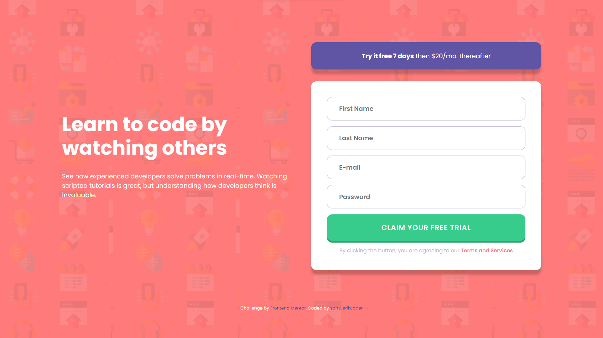

# Frontend Mentor - Intro component with sign up form solution

This is a solution to the [Intro component with sign up form challenge on Frontend Mentor](https://www.frontendmentor.io/challenges/intro-component-with-signup-form-5cf91bd49edda32581d28fd1). Frontend Mentor challenges help you improve your coding skills by building realistic projects. 

## Table of contents

- [Overview](#overview)
  - [The challenge](#the-challenge)
  - [Screenshot](#screenshot)
  - [Links](#links)
- [My process](#my-process)
  - [Built with](#built-with)
  - [What I learned](#what-i-learned)
  - [Continued development](#continued-development)
  - [Useful resources](#useful-resources)
- [Author](#author)

## Overview

### The challenge

Users should be able to:

- View the optimal layout depending on their device's screen size
- See hover states for interactive elements

### Screenshot

### Links

- Solution URL: [click here](https://intro-component-with-singup-form.netlify.app/)
- Live Site URL: [click here]()

## My process

### Built with

- Semantic HTML5 markup
- CSS custom properties
- Flexbox
- CSS Grid
- CSS Transitions
- Mobile-first workflow
- Javascript
- DOM
- Javascript Modules
- Factory Functions

### What I learned

Grid System: The code demonstrates the effective use of CSS Grid to create a responsive layout for the card components. The .card-columns class uses display: grid and grid-template-columns to define a three-column grid, allowing the cards to be arranged in a visually pleasing way.

Flexibility with Flexbox: Within each card, the content is organized using Flexbox. The .card class utilizes display: grid and gap to create a flexible and evenly spaced layout. The Flexbox model is powerful for arranging and aligning elements within containers.

Project Planning and Structure: The HTML structure is well-organized, making use of semantic tags like <main>, <article>, <footer>, 
, <strong>, <small>. The code shows a clear separation between the main content and the attribution section, enhancing code readability and maintainability.

Responsiveness: The code demonstrates a responsive design approach using media queries. By defining different styles for different screen sizes, the layout adapts to varying viewport widths.

Javascript Modules: The JS files of this project were divided into modules seeking to follow good practices of clean code through factory functions with cooerent names about their functionality.

Input and E-mail Validation in JS: In this project, regular expressions were used to validate the use of e-mail and common logic for the other fields.

### Continued development

In the next few codes I intend to explore more concepts of the flex box and the grid. I plan to start deploying animations with CSS as well and write simpler and more straightforward code. I want to explore the uses of class in JS.

### Useful resources

- [Project Structure](https://youtu.be/B2WL6KkqhLQ) - This helped me with Project planning, flex-box, grid container, responsiveness and css variables. I really liked this pattern and will use it going forward.
- [Box Shadow Generator](https://cssgenerator.org/box-shadow-css-generator.html) - This helped me get a preview of the shadows I would use on the components.
- [Screen Only Clas (.'sr-only')](https://kittygiraudel.com/snippets/sr-only-class/) - I used the css rules indicated in this article to ensure accessibility on the site

## Author

- Frontend Mentor - [@samuerikcoder](https://www.frontendmentor.io/profile/samuerikcoder)